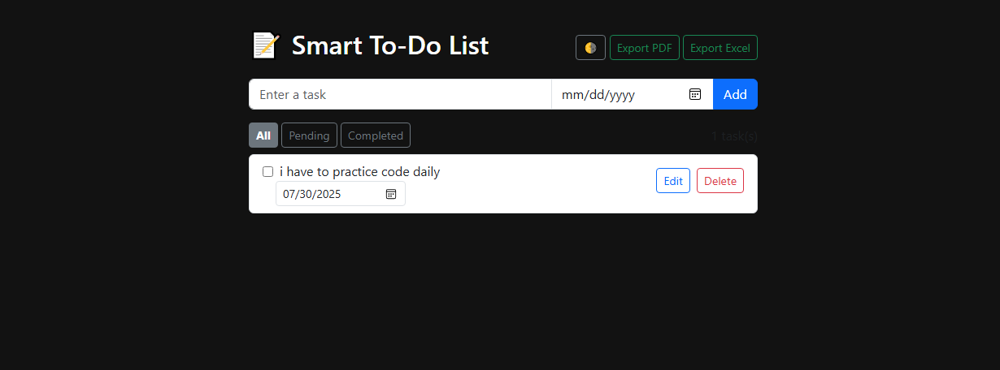

A modern, responsive to-do list web application built with HTML, CSS (Bootstrap), and JavaScript.  
Designed to showcase practical frontend skills and solve real user needs — including editing, reminders, filtering, and export options.<br>

---

## 🚀 Why I Built This<br>

As a self-driven learner transitioning into full-stack web development, I wanted to build a project that:<br>

- Uses **real-world logic and UI elements**<br>
- Applies **core JavaScript and DOM** concepts<br>
- Solves an actual productivity problem<br>
- Looks polished enough for **recruiters and freelance clients**<br>

This project reflects everything I’ve learned so far and pushes me to write clean, modular, reusable frontend code.<br>

---

## 📚 What I Learned While Building This<br>

✅ DOM manipulation (add/edit/delete HTML via JavaScript)  <br>
✅ Event handling and `localStorage` for persistence  <br>
✅ Using external libraries like **jsPDF** and **SheetJS**  <br>
✅ Building **responsive layouts** with Bootstrap  <br>
✅ Writing modular, maintainable code with clean folder structure  <br>
✅ Thinking like a user: mobile-first design, animations, and intuitive UX <br> 
✅ Creating export functionality for data-rich web apps <br>

---

## ✨ Features <br>

- ✅ Add, edit, delete tasks <br>
- ✅ Inline **due date editor**<br>
- ✅ Mark as **completed** or **pending** <br>
- ✅ Task **filters** (All / Completed / Pending) <br>
- ✅ **Dark/light theme** toggle <br> 
- ✅ **Export to PDF and Excel** <br>
- ✅ Animated UI (fade-in tasks) <br>
- ✅ Touch-friendly and mobile responsive <br>
- ✅ Auto-save tasks using `localStorage` <br>

---

## 🖼️ Screenshots <br>

> 📱 Mobile Responsive | 🌓 Dark Mode | 📤 Export PDF/Excel   <br>
 <br>
 <br>
---

## 🛠️ Technologies Used <br>

- **HTML5 + Bootstrap 5** <br>
- **Vanilla JavaScript** <br>
- **localStorage** (browser persistence) <br>
- [jsPDF](https://github.com/parallax/jsPDF) – export to PDF   <br>
- [SheetJS (xlsx)](https://github.com/SheetJS/sheetjs) – export to Excel   <br>

---

## 📁 Project Structure <br>

smart-todo-list/ <br>
├── index.html # Main HTML file <br>
├── style.css # Custom styles (dark/light mode, responsive tweaks) <br>
├── app.js # Application logic (modular JS) <br>
└── README.md # You're reading it! <br>

---

## 🧪 How to Run <br>

1. Download or clone this repo: <br>
```bash <br>
git clone https://github.com/suresh-2201/Smart-To-Do-List
Open the folder and launch index.html in your browser

✅ No installation needed – runs fully in browser (no server required) 
 

## 🙌 Acknowledgements

Inspired by Angela Yu's Web Development Bootcamp.

Made with ❤️ by Suresh Kumar Prajapat C